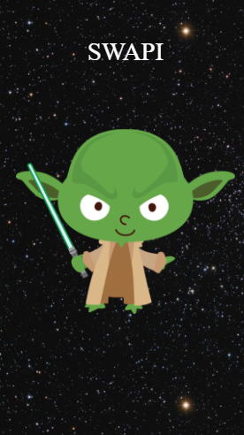
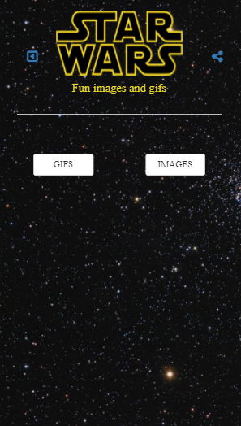
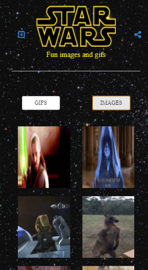
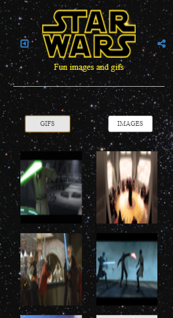
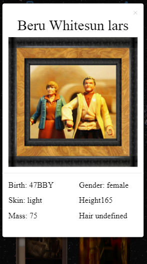

# SWAPI

## Objetivo:

- El objetivo de esta pagina es mostrar imagenes de los personajes de Starwars y sus datos en un modal. 

___

## Flujo de la aplicación

- Vista splash con duración de 2 a 5 segundos que redirecciona a tu vista de inicio. 
- La vista de principal, con dos botones para que el usuario pueda ver las imagenes de los prsonajes.  
- Una vez hecho click en el boton imagenes, apareceran todas las imagenes relacionadas a los personajes.
- Al hacer click en una de estas imagenes aparecera un modal con la información del personaje que escogio. 
___

## Herramientas Utilizadas:

- Html, para la estructura del contenido.
- Css, para darle estilo al contenido.
- JS6, para manipular el DOM y crear logica de la pagina.
- Ajax, para actualizar una parte de tu pagina sin recargarla.
- Api Swapi, para el contenido.
- Api Flickr, para traer las imagenes.
- Node.js, para proporcionar un entorno de ejecución del lado del servidor.
- Bootstrap

___

## Fuente consultada:

- [Laboratoria LMS](https://lms.laboratoria.la/cohorts/lim-2018-01-bc-js-front-end-developer/courses/spa/02-asynchronous-js-request/00-opening)

- [Bootstrap](https://getbootstrap.com/docs/3.3/css/#forms)

- [W3School](https://www.netconsulting.es/blog/nodejs/)

## Vistas Principales Mobile: 

1. Vista Splash:

2. Vista Principal:

3. Images:

4. Gifs:

5. Modal:

### Integrantes:
- Betsy Vidal
- Araceli Cueva
- Melissa Yauri
 
